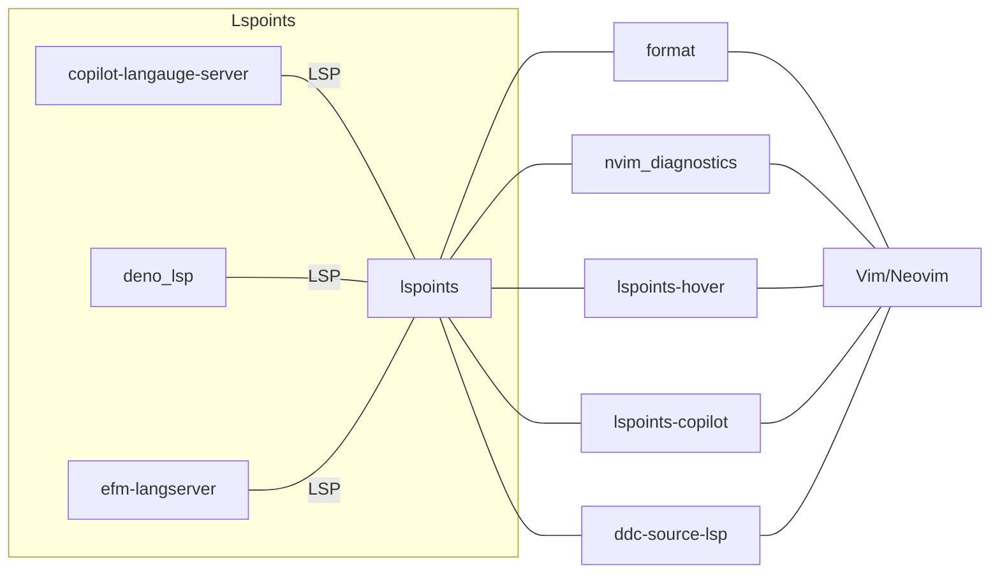

# lspoints

Asynchronous LSP Gateway Plugin powered by denops.vim


> [!WARNING]
> 
> As it is made for study, it may move strangely or break suddenly.
>

## Installation


You need to install lspoints with [denops](https://github.com/vim-denops/denops.vim) as follows:

```vim
Plug 'vim-denops/denops.vim'
Plug 'kuuote/lspoints'
```

> [!IMPORTANT]
>
> As lspoints is a *gateway*, you achive no functionalities without extensions.
> The following graph is the overview of the architecture.
> 



## Configuration

To use lspoints, you need to configure two things.

1. What *language servers* are available.
2. What *extensions* are available.


### Language servers

```vim
function s:attach_denols() abort
    call lspoints#attach('denols', #{
    \   cmd: ['deno', 'lsp'],
    \   initializationOptions: #{
    \     enable: v:true,
    \     unstable: v:true,
    \     suggest: #{
    \       autoImports: v:false,
    \     },
    \   },
    \ })
endfunction
autocmd FileType typescript,typescriptreact call s:attach_denols()
```

### Extensions

You need to specify extension to be used.
```vim
let g:lspoints#extensions = ['nvim_diagnostics', 'format']
```

Alternatively, you can load extensions dynamically.
```vim
call lspoints#load_extensions(['nvim_diagnostics', 'format'])
```

### Configuration example

<details>
<summary>
The example is just a combined version of the above code.
</summary>

```vim
let g:lspoints#extensions = ['nvim_diagnostics', 'format']
function s:attach_denols() abort
    call lspoints#attach('denols', #{
    \   cmd: ['deno', 'lsp'],
    \   initializationOptions: #{
    \     enable: v:true,
    \     unstable: v:true,
    \     suggest: #{
    \       autoImports: v:false,
    \     },
    \   },
    \ })
endfunction
autocmd FileType typescript,typescriptreact call s:attach_denols()
```

</details>


## Further readings

Again, you will not get any functionality without extensions. Please read the documentation of the extensions.
You can find the lspoint extensions at https://github.com/search?q=lspoints&type=repositories .


# nvim_diagnostics for lspoints (builtin)

This is an extension to integrate lspoints into the diagnostic function of Neovim.

## Installation

You need to add `'nvim_diagnostics'` to `g:lspoints#extensions`.
```vim
let g:lspoints#extensions = ['nvim_diagnostics']
```

## Usage

This extension automatically displays diagnostics in Neovim. You do not need to do anything.

# format for lspoints (builtin)

This is an extension to call format function of language servers.

## Installation

You need to add `'format'` to `g:lspoints#extensions`.
```vim
let g:lspoints#extensions = ['format']
```

## Usage

When you call `denops#request('lspoints', 'executeCommand', ['format', 'execute', bufnr()])`, the language server formats your code.

```vim
nnoremap mf <Cmd>call denops#request('lspoints', 'executeCommand', ['format', 'execute', bufnr()])<CR>
```

---

&copy; 2024 Kuuote